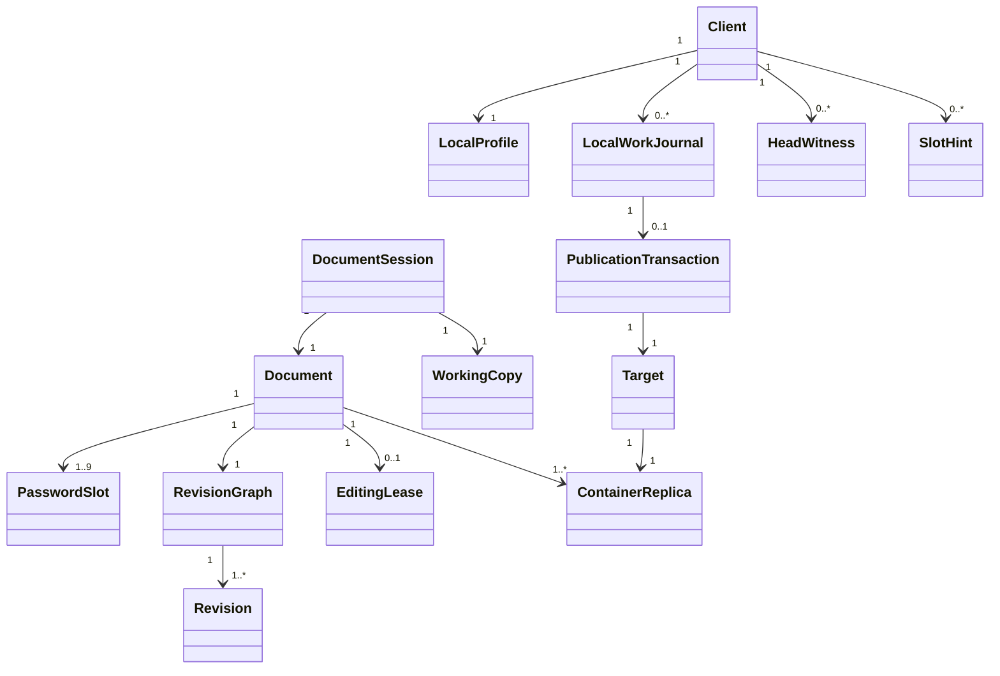

# SCPEFE domain model and glossary

Status: working terminology, started 19 September 2026. This document defines the canonical names used by the project. The specification defines behavior; this document defines how that behavior is described.

## 1. Naming rules

- Use **document** for the logical encrypted text and its durable metadata/history.
- Use **container** for one physical `.scpefe` serialization of a document.
- Use **replica** for another container carrying the same document ID.
- Use **target** for the storage location currently opened or published by a client.
- Use **file** only when discussing generic filesystem behavior or a user-visible path; prefer document, container, replica, or target when one is more precise.
- Use **password slot** for every password-based access entry. Do not use account, login, or user key.
- Use **document key** for the random 256-bit key protected by password slots. Do not call it the master password or master key.
- Use **recovery/master slot** only for the optional emergency administrative password slot.
- Use **manual save**, **regular save**, **recovery checkpoint**, and **publication** only with the meanings below; do not use autosave as an umbrella term.
- Use **client** for one installed SCPEFE environment with app-private state, **instance** for one running process, and **session** for one opened document within that instance.

## 2. Core domain relationships



Important boundaries:

- A container contains the shared document state: password slots, encrypted metadata, revision graph, current head, and editing lease.
- A local work journal and head witness belong to a client and are not part of the shared container.
- A backup is another replica, not a new document.
- A plaintext export is neither a container nor a replica.

## 3. Document and storage terms

| Term | Canonical meaning |
|---|---|
| Document | The logical SCPEFE object: current text, metadata, password slots, history, and lease state identified by one permanent document ID. |
| Document ID | A permanent random identifier shared by every legitimate replica of a document. It does not change during backup, migration, or compaction. |
| Container | One self-contained physical `.scpefe` representation of a document. |
| Target | The path, URI, or opaque host handle from which the active container was opened and to which it is published. |
| Replica | A container with the same document ID. Replicas may be byte-identical, stale, or divergent. |
| Backup replica | A verified byte-for-byte replica created by Backup or automatically before migration/compaction. |
| Active document | The single document currently open in the application instance. |
| Plaintext export | An intentionally unencrypted copy of only the current resolved text. |
| Publication | The process that makes a candidate container the current value at a target. |
| Publication transaction | The tracked prepare/write/flush/replace/verify/cleanup operation used for crash-safe publication. |
| Transaction file | The short-lived same-filesystem sibling used during a publication transaction. It is not a companion file or work journal. |
| App-private state | Client-local storage not placed beside the target, including preferences, work journals, head witnesses, slot hints, and transaction tracking. |

## 4. Revision and history terms

| Term | Canonical meaning |
|---|---|
| Revision | A history node with parent revision IDs, author/device metadata, timestamp, and either a snapshot or delta. |
| Sealed revision | An immutable revision produced by a manual save. |
| Provisional revision | The single amendable revision updated by optional regular saves since the last manual save. It remains logically unsaved. |
| Revision ID | The cryptographic identity/hash of a revision. |
| Revision graph | The hash-linked directed graph of revisions, including branches created by divergence. |
| Head | The revision representing the container's current resolved document state. |
| Snapshot | A full encrypted representation of document text at a point in history. |
| Delta | An encrypted representation of changes relative to another revision. |
| Checkpoint | A full snapshot placed within history to bound delta replay. Do not confuse it with a recovery checkpoint. |
| Branch | A line of revisions that diverged from a shared ancestor. |
| Divergence | The condition in which observed heads are not descendants of one another. |
| Conflict | A divergence requiring user-directed resolution before publication. |
| Merge | A new revision with multiple parents that records the user's resolution of divergent branches. |
| Compaction | An administrative rewrite that creates a fresh baseline, retains a shallow reference to the previous head, and removes older embedded revision bodies after backup. |
| Shallow parent | A retained parent revision ID whose full revision body has been removed by compaction. |

## 5. Password and identity terms

| Term | Canonical meaning |
|---|---|
| Password slot | An independently salted password wrapper for the same document key, plus encrypted identity and policy metadata. |
| Ordinary slot | One of at most eight non-recovery slots, including the owner slot and invited slots. |
| Owner slot | The first ordinary slot. It always has edit, add-password, and remove-password permissions. |
| Recovery/master slot | The optional ninth emergency administrative slot. It has full permissions, is checked last during normal unlock, and has no bound personal identity. |
| Invitation slot | An ordinary slot created with a temporary password and `mustBeChanged` set. |
| Claimed slot | An invitation slot whose temporary password has been replaced and whose identity is bound to the claimant's local profile. |
| View-only slot | A claimed ordinary slot with `canEdit` false. It may view, export, back up, and change its own password/identity through conforming applications. |
| Editor slot | An ordinary slot with `canEdit` true. |
| Full administrative slot | A slot with both `canAddPasswords` and `canRemovePasswords`; these permissions imply edit permission. |
| Slot ID | An immutable random identifier used internally to address a password slot. |
| Slot identity | The encrypted name and email bound to a claimed ordinary slot and displayed when administering slots. |
| Temporary label | A descriptive label used before an invitation slot is claimed. It is replaced by the claimed slot identity. |
| Local profile | The client's configured name and email used to claim slots and attribute revisions. It is self-asserted, not verified identity. |
| Device name | The client-configured machine/device label recorded per revision, not bound to a password slot. |
| Document key | The random 256-bit key wrapped independently by every password slot and used to derive purpose-specific subkeys. |
| Wrapping key | A key derived from one slot password with Argon2id and used to protect that slot's document-key material. |
| Slot hint | App-private memory of the last successful ordinary slot ID for a document. It contains no password or decrypted key. |

Password-slot permissions are cooperative policy for conforming clients. They are not a cryptographic boundary against a recipient who already knows a valid password and deliberately modifies the open-source software.

## 6. Access and lease terms

| Term | Canonical meaning |
|---|---|
| Locked | No document password/key or plaintext editing state is available to the UI. |
| Unlocked | A password slot has opened the document. An unlocked document initially remains in read-only mode. |
| Read-only mode | Unlocked viewing without an editing lease. This is the default open mode. |
| Edit mode | The document session owns or has reacquired the advisory editing lease and permits changes allowed by the slot policy. |
| Editing lease | Encrypted advisory shared state identifying the edit session permitted to publish changes. It is not a guaranteed distributed lock. |
| Lease session ID | A random identifier for one acquisition of an editing lease. |
| Heartbeat | A lease refresh containing the session ID, increasing counter, holder time, and lease duration. |
| Lease duration | The file-level interval after which an unrefreshed lease becomes eligible for takeover; ten minutes by default. |
| Stale lease | A lease whose heartbeat has not advanced for the applicable duration according to the available evidence. |
| Takeover | Acquisition of an expired/unclaimed lease by another session. |
| Forced takeover | An explicitly confirmed takeover used when clock or storage evidence cannot establish expiry reliably. |
| Clock-offset cache | Optional client-local estimates learned from observed heartbeats and used only as supporting lease evidence. |

```text
closed → locked → unlocked/read-only → edit mode
                    ↑                 ↓
                    └──── re-lock ────┘
```

Re-locking stops heartbeat refresh but does not immediately erase the lease from the container. A returning session resumes a valid lease or transparently reacquires an unchanged, unclaimed expired lease.

## 7. Working-state and save terms

| Term | Canonical meaning |
|---|---|
| Working copy | The in-memory editable text derived from the opened head plus local changes. |
| Dirty | The working copy differs from the last user-asserted manual save. |
| Local work journal | The one encrypted app-private record used for crash recovery, auto-lock recovery, offline saves, conflict state, and publication tracking. |
| Recovery checkpoint | A local work-journal update. It does not update the shared container or create a history revision. |
| Manual save | A user-asserted save that seals a revision and publishes it, or marks it pending publication when the target is unavailable. |
| Regular save | An optional timed save that updates the single provisional revision in the target. It does not seal the user's changes. |
| Pending publication | A user-saved journal state that cannot yet be published to the target. |
| Recovered unsaved work | Journal content restored after re-lock or unexpected exit; it remains logically unsaved. |
| Candidate container | The exact serialized/encrypted byte stream prepared for publication. |
| Clean | No unsaved, provisional, pending-publication, or unresolved-conflict state exists. |

```text
working copy ──recovery checkpoint──> local work journal
      │
      ├──manual save──> sealed revision ──publication──> target
      │
      └──regular save─> provisional revision ─publication─> target
```

## 8. Client and implementation terms

| Term | Canonical meaning |
|---|---|
| Client | One installed/configured SCPEFE environment with a local profile, preferences, work journals, witnesses, and slot hints. |
| Instance | One running SCPEFE application process. Initial releases permit one instance per logged-in desktop session. |
| Document session | The runtime state for the single document currently open in an instance. |
| Head witness | The last sealed revision ID remembered by a client for rollback/replacement detection. |
| `libscpefe` | The platform-neutral C++ library exposing format, cryptography, session, configuration, and orchestration APIs through a versioned C ABI. |
| Host-services interface | The public `libscpefe` function-table contract for document I/O, app-private storage, clocks, preferences, lifecycle input, and storage capabilities. |
| Platform adapter | A Windows, POSIX/Linux, Android, test, or third-party implementation of the host-services interface. |
| Frontend | The Electron, Capacitor, CLI, or embedding UI that creates an adapter and SCPEFE context and presents structured library results. |
| SCPEFE context | A non-global `libscpefe` instance created with one registered host-services implementation. |

## 9. Domain invariants

- A document has one permanent document ID.
- Every legitimate replica of a document carries that same document ID.
- A document has one owner slot, zero or one recovery/master slot, and no more than eight ordinary slots total.
- Every password slot wraps the same document key.
- At most one provisional revision exists after the last sealed revision.
- A conforming application opens a document in read-only mode and enters edit mode only after lease acquisition.
- A client stores at most one local work journal per document.
- Shared durable state belongs in the container; client recovery state belongs in app-private storage.
- Persistent adjacent files are not required. Explicit backup replicas and short-lived transaction files are the documented exceptions.
- Manual save seals history; regular save does not.
- A new client without a head witness cannot prove that an otherwise valid container is the newest replica.
