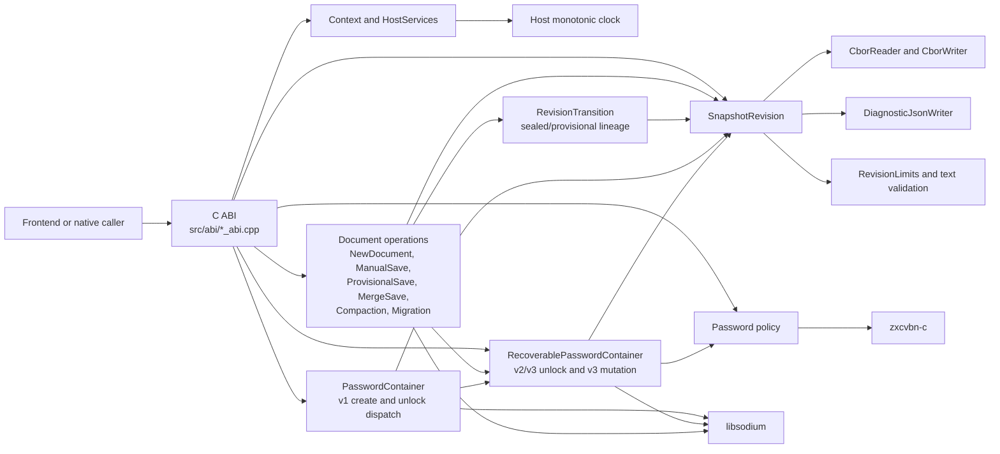

# C++ library architecture

This guide describes the **implemented** C++ common library, `libscpefe`. It is a code map, not a replacement for the [specification](SPECIFICATION.md) or the [domain glossary](DOMAIN_MODEL.md). The public entry point is the versioned C ABI in [`include/scpefe/scpefe.h`](../include/scpefe/scpefe.h); the C++ classes under `src/` are internal implementation details.

The library accepts byte spans and structured inputs, validates and encodes snapshot revisions, encrypts or unlocks self-contained containers, and returns replacement container bytes for document operations. The caller owns the target, app-private state, publication, and user interaction. In particular, the currently registered host-services table supplies a monotonic-clock callback to `Context`; the document functions do not use that context to read or write a target.

## How the pieces fit

Arrows show calls or dependencies, not ownership. `SnapshotRevision` works with already-decrypted revision data; the container classes provide the password and encryption boundary. `Context` currently serves the health API and is separate from the byte-oriented document operations.

## Classes by responsibility

### Core (`src/core/`)

| Class | Responsibility |
| --- | --- |
| [`Context`](../src/core/context.hpp) | Owns one `HostServices` adapter and serves the context health operation. It is not currently an open document session. |
| [`HostServices`](../src/core/host_services.hpp) | Wraps the host-provided instance pointer and monotonic-clock callback, returning failure if the callback fails. |

[`HealthInfo`](../src/core/health_info.hpp) is the internal result value converted into the C health structure. The matching C ABI code is [`context_abi.cpp`](../src/abi/context_abi.cpp).

### Revision format (`src/format/`)

| Class | Responsibility |
| --- | --- |
| [`SnapshotRevision`](../src/format/snapshot_revision.hpp) | Owns one validated version-1 snapshot revision. It validates semantic fields, encodes deterministic CBOR, decodes CBOR, and renders diagnostic JSON. This is a *revision-record* version, separate from the container-envelope version. |
| [`CborReader`](../src/format/cbor_reader.hpp) | Parses the strict deterministic-CBOR subset and enforces bounds, canonical encoding, and nesting limits. |
| [`CborWriter`](../src/format/cbor_writer.hpp) | Writes deterministic CBOR primitives used to serialize a revision. |
| [`RevisionLimits`](../src/format/revision_limits.hpp) | Carries maximum input, text, byte-string, collection, nesting, and parent counts for revision processing. |
| [`DiagnosticJsonWriter`](../src/format/diagnostic_json_writer.hpp) | Escapes strings and formats bytes for the developer-facing JSON view. Content is included only when requested. |

[`SnapshotRevisionData` and `RevisionGraphNodeData`](../src/format/snapshot_revision_data.hpp) hold the semantic revision fields and ancestor graph nodes. A revision contains the current snapshot text, content hash, author and device attribution, parent IDs, and optional provisional or event fields. The ancestor graph stores IDs and parent links used for related-head checks; it does not store every ancestor's text. [`text_validation.hpp`](../src/format/text_validation.hpp) checks UTF-8 and canonical document text. [`RevisionFailure`](../src/format/revision_error.hpp) carries errors to the ABI layer, where they become C status codes. The matching bridge is [`revision_abi.cpp`](../src/abi/revision_abi.cpp).

### Encrypted containers (`src/container/`)

| Class | Responsibility |
| --- | --- |
| [`PasswordContainer`](../src/container/password_container.hpp) | Creates the draft version-1, single-owner envelope. On unlock it recognizes and delegates version-2/3 containers to `RecoverablePasswordContainer`, otherwise authenticates a version-1 container. |
| [`RecoverablePasswordContainer`](../src/container/recoverable_password_container.hpp) | Creates current version-3 containers, unlocks version-2/3 envelopes, and produces replacement bytes for snapshot, lease, password-slot, identity, and migration changes. It implements the envelope parsing, key derivation, authenticated encryption, and password-slot checks. |

[`UnlockedContainerData`](../src/container/unlocked_container_data.hpp) is the move-only authenticated result of unlocking. It contains the document ID, selected slot and permissions, derived work-journal key, lease and managed-slot metadata, and the encoded snapshot revision. Its destructor clears owned sensitive values. The same header defines `EditingLeaseData` and `ManagedSlotData`; [`ContainerFailure`](../src/container/container_error.hpp) carries container errors to the ABI. The larger version-3 implementation also uses private layout and invitation-record structs to parse its envelope. The C bridge is [`container_abi.cpp`](../src/abi/container_abi.cpp).

### Document operations (`src/document/`)

These classes are stateless operation entry points. They build or transform a revision and ask `RecoverablePasswordContainer` to return a complete candidate container. They do not keep a working copy or publish the bytes to a target. `RevisionTransition` owns the parent and ancestor links for manual, regular, and merge saves, migration, and compaction; validates a provisional head against its embedded sealed base; and returns that base for discard.

| Class | Responsibility |
| --- | --- |
| [`NewDocument`](../src/document/new_document.hpp) | Builds the initial attributed snapshot revision and creates a version-3 container with an owner slot and optional recovery/master slot. |
| [`ManualSave`](../src/document/manual_save.hpp) | Authenticates the current container, delegates sealed revision construction to `RevisionTransition`, and replaces the encrypted snapshot. |
| [`ProvisionalSave`](../src/document/provisional_save.hpp) | Delegates creation, amendment, and discard of the one provisional revision to `RevisionTransition`, then replaces the encrypted snapshot. |
| [`RevisionTransition`](../src/document/revision_transition.hpp) | Builds attributed sealed, provisional, merged, and migration revisions from authenticated heads; creates the shallow compaction baseline; checks merge ancestry and provisional lineage; and returns a sealed base on discard. |
| [`MergeSave`](../src/document/merge_save.hpp) | Authenticates and authorizes current and local containers for the same document, delegates related divergent lineage and caller-supplied resolved text to `RevisionTransition`, then replaces the current container. |
| [`Compaction`](../src/document/compaction.hpp) | Requires full administrator permissions, a matching active lease, and a sealed head; creates a fresh baseline with the previous head ID as a shallow parent. |
| [`Migration`](../src/document/migration.hpp) | Builds a content-preserving migration revision and asks the container layer to convert a supported version-2 envelope to version 3 while retaining unknown password wrappers. |

### Password policy (`src/security/`)

[`assess_password_policy`](../src/security/password_strength.hpp) is a function, not a class. It classifies a newly proposed password by length and predictability using `zxcvbn-c`, with a special case for valid version-4 UUID passwords. The container and C ABI paths use its result when creating or changing passwords. `libsodium` supplies the cryptographic primitives used by the container layer and revision/content hashing; the library does not implement those primitives itself.

## One document through the library

1. **Create:** `scpefe_new_document_create` validates the C inputs and password policy. `NewDocument` makes an initial `SnapshotRevision`, encodes it with `CborWriter`, and asks `RecoverablePasswordContainer` to encrypt a version-3 container. The caller receives the candidate bytes and publishes them to a target.
2. **Open:** `scpefe_password_container_unlock` calls `PasswordContainer::unlock`. For version 2 or 3, it delegates to `RecoverablePasswordContainer::unlock`, which authenticates a password slot, decrypts the snapshot and metadata, and validates the embedded revision. The caller can borrow values from the returned unlocked handle, then must destroy it.
3. **Edit and save:** The caller supplies current container bytes, password, text, and attribution to `scpefe_manual_save` or `scpefe_regular_save`. `ManualSave` creates a sealed revision; `ProvisionalSave` creates or amends a provisional one. Each returns a new candidate container through `RecoverablePasswordContainer::replace_snapshot`. The caller handles target checks and publication.
4. **Other changes:** Merge, compaction, migration, invitation management, password changes, identity reconciliation, and lease updates similarly produce replacement bytes. They do not mutate a file in place.

The public ABI uses explicit sizes for byte spans and result buffers. Encode and mutation calls report the required output size with `SCPEFE_STATUS_BUFFER_TOO_SMALL` when caller storage is absent or insufficient. Decoded revision and unlocked-container handles own their values; their `view` APIs borrow pointers valid until the matching destroy call. Internal `RevisionFailure` and `ContainerFailure` values are translated to stable `scpefe_status` results at the ABI boundary.

## Build boundary and further reading

Native CMake builds compile the C ABI, format, container, document, core, and security sources into the shared library. The Emscripten target compiles only the portable revision-format sources and revision ABI. The optional [`apps/windows/native/addon.cpp`](../apps/windows/native/addon.cpp) is a Node-API consumer of `libscpefe`, outside the library itself. See [`CMakeLists.txt`](../CMakeLists.txt) for the exact source lists and the [container format documents](format/password-container-v3.md) for envelope details.
