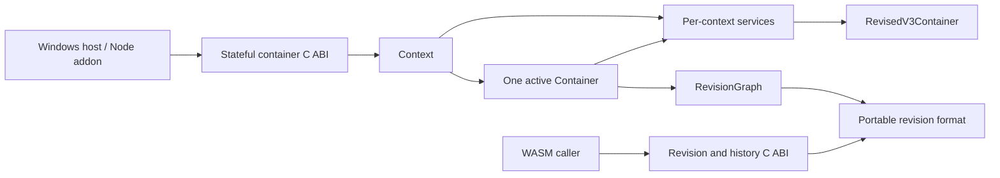

# C++ library architecture

This guide maps the implemented `libscpefe` library. The [specification](SPECIFICATION.md), [domain glossary](DOMAIN_MODEL.md), and [revised v3 container format](format/password-container-v3.md) define its contracts. The public entry point is the versioned C ABI in [`include/scpefe/scpefe.h`](../include/scpefe/scpefe.h); classes under `src/` are internal.

## Ownership and boundaries

```mermaid
flowchart LR
    Host["Windows host / Node addon"] --> ABI["Stateful container C ABI"]
    ABI --> Context["Context"]
    Context --> Container["One active Container"]
    Context --> Services["Per-context services"]
    Container --> Services
    Services --> V3["RevisedV3Container"]
    Container --> Graph["RevisionGraph"]
    Graph --> Format["Portable revision format"]
    WASM["WASM caller"] --> FormatABI["Revision and history C ABI"]
    FormatABI --> Format
```

[`Context`](../src/core/context.hpp) owns its host clock adapter, injectable service registry, and at most one active [`Container`](../src/container/container.hpp). It destroys the container before the services. The container owns the installed access, edit, lease, attention, and publication state, plus confirmed encrypted bytes and at most one unresolved candidate. [`ContainerStateManagerService`](../src/container/container_state.hpp) checks state transitions; observers are notified only after a transition is installed.

The host owns the document target, work journal, backup/export destinations, user interaction, and publication result. Windows calls the stateful C ABI through [`addon.cpp`](../apps/windows/native/addon.cpp). The library never writes a document file. A prepared candidate is copied from the handle, journaled, and published by the host; `acknowledge_save` or `resolve_save` installs it only after the host confirms the exact publication outcome. Ambiguous results retain the candidate for reconciliation. Target rereads and authenticated rights checks occur before publication.

### Host-owned target seam

[`DocumentService`](../apps/windows/src/document-service.mjs) accepts a stable opaque target reference and routes document reads through a host target adapter when one owns that reference. [`PublicationService`](../apps/windows/src/publication.mjs) retains the exact candidate in [`WorkJournalStore`](../apps/windows/src/work-journal.mjs), asks the adapter to publish that candidate against the observed base, then rereads and compares all bytes. An adapter declares read/reread, exact candidate publication, exact-byte verification, and verified/definite/ambiguous outcomes. A reported verified write without matching bytes is ambiguous; a reported uncertain write with matching bytes is verified. A changed target becomes a conflict, while a missing or unavailable target keeps the candidate pending. A definite failure with an unchanged target restores the prior journal and rejects the candidate without claiming publication. The adapter must not treat a provider URI revision token, display name, timestamp, or size as the authenticated container head, lease, or freshness witness.

| Existing location | Path assumption | Host-owned treatment |
| --- | --- | --- |
| `DocumentService` | Direct `fs.readFile(target)` and path-based create/delete | Target reads and create/delete pass through the adapter; profile, settings, and client-local state remain app-private filesystem calls in this host. |
| `PublicationService` | Sibling transaction and recovery-base paths, rename, hard link, stat, and readback | Windows keeps those algorithms for path targets. An opaque target uses a journaled candidate and adapter publication with exact-byte reread; backup and plaintext destinations remain separate host actions. |
| `WorkJournalStore` | Target and transaction file are both path strings | Target is a stable opaque string key, encrypted in the journal and hashed for discovery. A `host-target` publication record omits sibling and recovery-base paths; filesystem records retain their existing layout. |
| C ABI | `scpefe_host_services_v1` supplies only `monotonic_time_ms`; container operations accept observed and candidate bytes | No path or provider handle enters the v1 table or encrypted format. The host continues to own I/O and reports publication through the existing candidate-finish calls. |

This choice preserves the existing v1 ABI and container format for Windows and embedders. It moves no existing journal or setting schema into C++; adapters can add provider-specific staging and permission persistence without recompiling the library. A later C-owned storage interface would require a new versioned function table, migration of every host adapter and embedding caller, and a separate compatibility plan for existing app-private journals. It is not implied by the broad original specification language.

For manual and regular saves, password-slot changes, editing-lease acquisition, heartbeat, takeover, and release, divergence resolution, compaction, and activity events, [`DocumentService`](../apps/windows/src/document-service.mjs) checks operation eligibility and the current authenticated target before asking [`CandidatePublication`](../apps/windows/src/candidate-publication.mjs) to coordinate the exact native candidate. Divergence resolution retains target identity, merge ancestry, current password-slot rights, and the editing lease at this calling seam. Compaction retains its full administrative, clean sealed state, held lease, confirmation, and exact verified backup checks before candidate preparation. Suspended lease release uses the same protocol, retaining its prepared candidate and journal key until publication is verified or definitely fails. `CandidatePublication` owns the host's pending native operation identity, settles caller failures before or after journal preparation, distinguishes verified, definite, and ambiguous outcomes, and reconciles a journaled candidate on reconnect. A journal record proves preparation only when it holds the exact candidate bytes, including when an older conflict record exists. `DocumentService` updates its active session only after that protocol returns a verified result; failure settlement never claims a new published head. [`PublicationService`](../apps/windows/src/publication.mjs) retains the target transaction, byte verification, resume, and cleanup algorithms; [`WorkJournalStore`](../apps/windows/src/work-journal.mjs) stores the encrypted recovery record. The public test seam is `DocumentService` with a real native container and fault-injected host storage.

[`ActivityEventWorkflow`](../apps/windows/src/activity-event.mjs) owns the backup and plaintext-export attempt, durable external-action start and completion, outcome publication, and restart reconciliation. It uses `CandidatePublication` for each native activity candidate and `PublicationService` for target publication; it does not copy replicas or write plaintext itself. `DocumentService` retains backup eligibility, destination-specific actions, active-session adoption, and the public results. An interrupted action is never repeated automatically: its outcome is confirmed, with successful results checked against the recorded expected bytes. A published matching outcome clears only its pending activity record from the single work journal.

## Container and history

[`RevisedV3Container`](../src/container/revised_v3_container.hpp) is the only encrypted document reader and writer. It validates the revised 72-byte v3 framing and size limit before password derivation, authenticates a wrapper and complete payload, then validates its revision graph. It creates the initial baseline and encrypts replacement graph, lease, and slot candidates. Older v1/v2 envelopes and the former 160-byte transitional v3 layout are unsupported; no migration path is exposed.

[`PersistenceService`](../src/core/persistence_service.hpp) delegates envelope creation, validation, authentication, and replacement to `RevisedV3Container`. [`PasswordService`](../src/core/password_service.hpp) applies proposed-password policy. [`EncryptionService`](../src/core/encryption_service.hpp) supplies cryptographic operations. [`HistoryService`](../src/core/history_service.hpp) chooses a compaction cutoff and builds a revised-v3 graph. [`MergeSave`](../src/document/merge_save.hpp) validates related authenticated replicas and builds the resolved merge graph used by the container's merge candidate. These services can be substituted independently in context tests.

[`RevisionGraph`](../src/format/revision_graph.hpp) owns a validated decrypted v3 payload and its canonical content line. It verifies immutable IDs, content and body hashes, predecessor and merge links, and checkpoint/pruning state. It distinguishes an unavailable pruned or foreign body from an unknown revision ID. `Container::read_unlocked` borrows authenticated data under access rules; `scpefe_container_revision_graph` copies it into an independent owner for history views.

The portable format layer also contains [`SnapshotRevision`](../src/format/snapshot_revision.hpp), deterministic CBOR reader/writer, text validation, revision limits, and diagnostic JSON. Snapshot revision format version 1 is distinct from container envelope version 3. The Emscripten build compiles only the portable revision and history format code plus their C ABI; it has no encrypted-container reader or document mutation surface.

## Lifecycle through the C ABI

1. `scpefe_container_create` prepares a revised-v3 baseline. The host publishes those bytes and opens them through a context-owned container handle.
2. `scpefe_container_open` validates public framing and enters locked state. `scpefe_container_unlock` authenticates a password slot and graph, then exposes permitted clear content and copied authenticated metadata.
3. The host submits working text and confirms its edit lease. `prepare_save`, `prepare_merge`, `prepare_compaction`, `prepare_slot_change`, `prepare_lease_change`, or an activity operation retains one exact candidate. `assess_merge` checks a prospective merge without retaining bytes or changing state.
4. The host journals and publishes candidate bytes, then reports verified success or definite failure. On uncertain publication it rereads the target and resolves the retained candidate. A successful acknowledgement adopts the candidate's authenticated state. Closing destroys the active handle and sensitive owned state.

The ABI returns stable status codes for malformed containers, unsupported formats, authentication failure, invalid state, missing or unavailable revision bodies, stale operations, unrelated targets, rollback, merge-base loss, and target rights changes. Caller-provided byte spans carry explicit lengths. Copy operations report the required size with `SCPEFE_STATUS_BUFFER_TOO_SMALL`; owned result views remain valid until their matching destroy call. The password-policy ABI is separate from the stateful document lifecycle.

Native CMake builds compile the container, document, core, format, security, and C ABI sources. See [`CMakeLists.txt`](../CMakeLists.txt) for source lists and tests.
